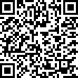

# tilecopy

Windows-only terminal tool (C++23, MSVC) that copies a file, folder or whole
drive between **local drives** using a chunk-hash delta-copy algorithm: on the
first run it builds a database of SHA-256 chunk hashes (configurable chunk
size, default 1 MiB) of the source; on later runs only the chunks that changed
are rewritten on the destination.

It can also take **raw sector images** of a whole physical disk (`--drive` to
a `.vhdx`) or of a single partition (`--partition`), producing a dynamic VHDX
that mounts natively in Windows (double-click, Disk Management, or
`Mount-DiskImage`), with the same chunk database making later runs read only
the source and rewrite only what changed.

## Build

Requires Visual Studio 2022 (MSVC, C++23) and CMake 3.25+.

```
cmake -S . -B build -G "Visual Studio 17 2022"
cmake --build build --config Release
```

## Usage

```
tilecopy --file   <source-file> <dest-file>   [options]
tilecopy --folder <source-dir>  <dest-dir>    [options]
tilecopy --drive  <X:>          <Y:|dest-dir> [options]
tilecopy --drive  <X:|N|\\.\PhysicalDriveN>   <image.vhdx> [options]
tilecopy --partition <X:|\\?\Volume{GUID}\|\\.\HarddiskVolumeN> <image.vhdx> [options]
tilecopy --file/--folder/--drive/--partition <source> --make-db [options]
```

Common options:

| Option | Meaning |
|---|---|
| `--db <path>` | Chunk-database file to use. Defaults to the destination side: `<dest-file>.tcdb`, `<dest-dir>\tilecopy.tcdb`, `Y:\tilecopy.tcdb`. With `--make-db` and no destination it is derived from the source instead |
| `--make-db` | Only (re)generate the chunk database, copy nothing; destination may be omitted |
| `--chunk-size <size>` | Delta chunk size, `4K`–`64M` (`K`/`M` suffixes or plain bytes, default `1M`). A database built with a different chunk size is discarded and rebuilt |
| `--max-tries <n>` | Attempts per file before giving up (default **1**) |
| `--no-file-logs` | Do not print a line per file copied/moved; only the initial and final messages (and errors) are printed |

Folder/drive options:

| Option | Meaning |
|---|---|
| `--mirror` | Delete destination entries that do not exist in the source |
| `--no-move-detection` | Do not detect moved/renamed source files (see below) |
| `--move-detection-check-date` | Only consider move candidates whose last-write time also matches the record. Cuts down how many new files must be hashed, but misses moves done by tools that rewrite write times (e.g. Explorer copies) |
| `--exclude-file <p>` | Exclude a file (repeatable; absolute or relative to the source root). Left untouched on the destination when mirroring |
| `--exclude-folder <p>` | Exclude a folder subtree (repeatable, same semantics) |
| `--mt` | Enable multithreaded copying (default: off) |
| `--threads <n>` | Max worker threads, 1–32 (default 8; only used with `--mt`) |
| `--folder-logs` | Instead of a line per file, print one line per folder checked with the number of files copied from it (implies `--no-file-logs`) |
| `--ntfs-map-origin` | Read the source volume's NTFS USN change journal to visit only entries changed since the last run instead of walking the whole tree. The journal position is stored in the database; needs administrator rights. Falls back to a full scan whenever the journal cannot be trusted (see below) |

## Raw image copies (`--drive` to a `.vhdx`, and `--partition`)

A `.vhdx` destination switches `--drive` to a raw sector copy, and
`--partition` always is one. Both need an **elevated console**.

- **Source forms** — `--drive C:` images the whole physical disk that
  contains volume `C:` (rejected if the volume spans disks); `--drive 0` and
  `--drive \\.\PhysicalDrive0` name the disk directly. `--partition` takes a
  drive letter, a volume GUID path (`\\?\Volume{...}\`, as listed by
  `mountvol` — works for volumes without a letter, e.g. locked/encrypted
  ones), or `\\.\HarddiskVolumeN`.
- **Destination** — a dynamic VHDX created and attached through the Virtual
  Disk API (1 MiB block size, sector size taken from the source disk). The
  disk is attached outside the PnP stack (non-PnP) where Windows supports
  it, so the image's file system can never be mounted mid-write and
  detaching is instant; older systems fall back to a PnP attach with no
  drive letters, kept offline — there, system services racing into the
  image's volume can make the final detach take a while. A
  whole-disk image carries the source's own partition table; a `--partition`
  image wraps the volume in a generated GPT with a single basic-data
  partition at a 1 MiB offset, so mounting it surfaces the volume with a
  drive letter.
- **Consistency** — every volume on the source with a mounted file system is
  put into one VSS snapshot set (writer-involved for application
  consistency, falling back to a writerless snapshot, then to live reads,
  with a log line whenever it degrades). Volume data is read from the shadow
  devices; regions without a snapshottable volume (partition gaps, boot
  areas, unformatted or locked partitions) are read live from the raw
  device. Removable drives cannot be snapshotted at all and are read live —
  incremental runs still work there; a file being written during the copy is
  simply caught by its changed hashes on the next run. An **unlocked BitLocker volume is imaged decrypted** (the copy
  mounts as plain NTFS); a locked one is copied as raw ciphertext in full.
- **Skipped data** — unallocated clusters (from the volume bitmap; works on
  NTFS, FAT32 and exFAT) are neither read nor written; on the first run they
  stay unallocated in the VHDX, keeping it small. The contents of
  `pagefile.sys`, `hiberfil.sys` and `swapfile.sys` are stored as zeros.
  File systems without a queryable bitmap (e.g. FAT12/16) are read in full,
  though later runs still write only changed chunks.
- **Incremental runs** — the database keeps one SHA-256 per chunk of the
  source address space plus the VHDX's size and write time as recorded after
  the previous run. When they still match, only the source is read; chunks
  whose hash matches the record are skipped, everything else is rewritten in
  place. **The destination is never read.** If the VHDX was modified by
  anything else in between — including being mounted read-write — every
  chunk is rewritten, so **mount images read-only**
  (`Mount-DiskImage -Access ReadOnly`, or attach read-only in Disk
  Management).
- **Database size** — one 32-byte hash per chunk: ~32 MiB per TiB of source
  at the default 1 MiB chunk size. Use a larger `--chunk-size` (up to 64M,
  multiple of 4K) for very large disks.
- `--mt`/`--threads` parallelize chunk reads/hashes/writes; `--max-tries`
  retries failed chunk reads/writes. `--make-db` hashes the source without
  touching any destination (needs `--db` when no destination is given). Not
  valid: `--mirror`, move detection options, `--exclude-*`, `--folder-logs`,
  `--ntfs-map-origin`.
- A failed chunk (or a failed final flush) clears the recorded destination
  state, so the next run rewrites everything rather than trusting a
  half-updated image. Copying a system disk to a file on that same disk is
  allowed (the snapshot keeps the copy consistent) but noisy: the image's
  own blocks change every run.

## Behavior

- **Delta copy**: a file is rewritten chunk-by-chunk only where the chunk hash
  differs from the database. The delta path is used only when the destination
  file's size matches what the database recorded from the previous run;
  otherwise a full copy is performed (and the database refreshed). Files whose
  size + last-write time match the database and whose destination looks intact
  are skipped entirely.
- **Move detection** (folder/drive, on by default): a database record whose
  path truly vanished from the source paired with a new source file of the
  same size whose content matches (the new file is hashed and compared to the
  recorded chunk hashes) is renamed at the destination instead of re-copied,
  and the record is adopted under the new path. Write times are ignored by
  default because tools like Explorer rewrite them when copying;
  `--move-detection-check-date` requires them to match too. Disable with
  `--no-move-detection`.
- **Drive copies** skip NTFS metadata files (`$MFT`, `$LogFile`, `$Extend`, …),
  `$Recycle.Bin`, `System Volume Information`, and the pagefile family at the
  drive root. The destination may be a drive or a folder; the source drive's
  contents are copied into it.
- A folder/drive **destination inside the source tree** (e.g.
  `--drive C: C:\backup`) is rejected — it would be copied into itself — unless
  it is covered by `--exclude-folder`.
- **Metadata** (attributes, creation/access/write times, owner/group/DACL, and
  SACL when running elevated) is always copied, best-effort, for files and
  folders. Directory timestamps are applied children-first so they survive.
- **Symbolic links, junctions and other reparse points** are copied as links,
  never followed — including during mirror deletion. Creating symlinks may
  require elevation or Windows Developer Mode.
- **Empty folders** are always created.
- **USN incremental scans** (`--ntfs-map-origin`, folder/drive only): the
  database additionally stores the source volume's USN journal identity and
  position. Later runs read only the journal records since that position and
  visit just the entries reported created/changed/renamed/deleted; every other
  file — including its destination copy — is trusted as unchanged. This means
  destination-side damage to untouched files goes unseen until the source
  changes; run once without the flag (or delete the database) to force a full
  verification pass. Reading the journal needs administrator rights. Any
  condition that makes the journal untrustworthy — first run, non-NTFS source,
  journal wrapped or recreated, different volume, changed exclude list, a
  failed previous run, or a `--make-db`-only refresh followed by a copy —
  automatically falls back to a full scan. Changes made through hard-link
  aliases outside the source tree may be missed (hard-link topology is not
  preserved anyway), and `--folder-logs` prints no per-folder lines on
  incremental runs.
- Only local drives (fixed/removable) are supported; UNC paths and mapped
  network drives are rejected.
- Exit codes: `0` success, `1` bad arguments/setup, `2` completed with
  failures (or the database could not be saved).

## Design decisions

1. **The DB file is automatically excluded** from copying, from landing on by
   a copied file, and from mirror deletion. Use `--db` to place it elsewhere
   (a drive root may need elevation to write to).
2. **`--mt`/`--threads` are folder/drive-only** (a single-file copy has nothing
   to parallelize at file granularity). Threading parallelizes across files,
   not within one file.
3. **Chunk size** is set with `--chunk-size` (default 1 MiB); using a different
   value than the existing database silently discards and rebuilds it.
4. **Trust model**: unchanged files are detected via size + last-write time,
   like robocopy/rsync defaults. If the destination was modified behind
   tilecopy's back at equal size, the delta pass corrects any chunk whose hash
   changed **on the source** but cannot see destination-only tampering. A
   `--verify` mode reading the destination could be added later.
5. **Retries** wait 250 ms between attempts; links get the same `--max-tries`
   as files.
6. Alternate NTFS data streams and hard-link topology are **not** preserved
   (only the default stream is copied).
7. **`--ntfs-map-origin` databases** use a version-2 layout carrying the
   journal position; databases written without the flag keep the version-1
   layout unchanged. Any failed entry invalidates the stored position, so the
   next run walks everything instead of trusting a checkpoint that skipped a
   broken file.
8. **Raw image databases** use a version-3 layout (source identity, the
   VHDX's recorded size/write time, and one hash per chunk; an all-zero hash
   marks a chunk left as a hole). Image and file databases never mix: a
   database of the wrong flavor is discarded and rebuilt.

## Donations are welcome

If you liked this software and would like to support its development, you can buy me a coffee. Understand that any value is fine and appreciated, and that your support means a lot to me. Thank you!

[Paypal donation](https://www.paypal.com/donate/?business=NUHKNZCBCPCLQ&no_recurring=0&currency_code=USD)



## Check out my other projects

- [qt6appskeleton](https://github.com/riozebratubo/qt6appskeleton): a cross-platform Qt6 app skeleton with sqlite persistence and settings
- [Winzoo](https://github.com/riozebratubo/winzoo): a lightweight taskbar replacement for Windows 10/11
